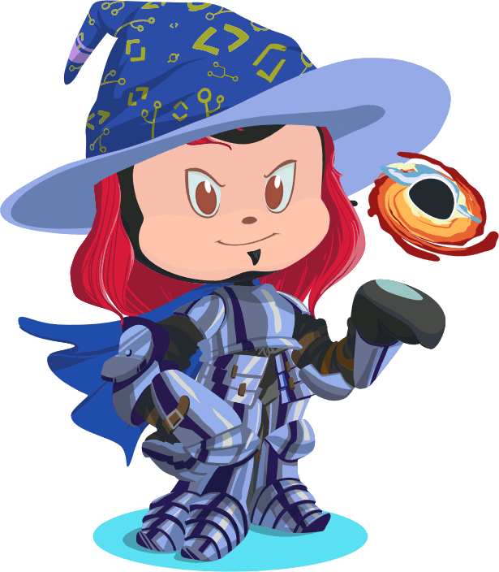

## Good Morning! ☀️ 

> “Good Morning!" said Bilbo, and he meant it. The sun was shining, and the grass was very green. But Gandalf looked at him from under long bushy eyebrows that stuck out further than the brim of his shady hat.  
— J.R.R. Tolkien | The Hobbit

### Hello there, I'm Gimleux 🏔️

😄 My Pronouns:   
🌱 I’m currently learning **JavaScript**, **TypeScript**

 

    
    
    
<!--<a href="https://github.com/ryo-ma/github-profile-trophy">-->
    
    

